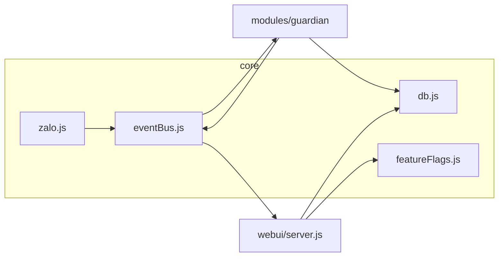

# Blueprint — zalo-guardian

## Kiến trúc

- **Single bridge tới Zalo**: `core/zalo.js` import động `zcaPath`, chỉ nơi đây gọi zca-js.
- **Modules**: chỉ nói chuyện qua `eventBus` + SQLite, không import zca trực tiếp (trừ khi sau này cần `getApi()` cho hành động gửi tin).

## Luồng tin nhắn

1. `api.listener` → `zalo:message` trên bus.
2. `guardian/index.js` lọc theo `watchGroups`, gọi `detectSpam` (rules từ `config.json`).
3. Vi phạm → `INSERT violations`, emit `guardian:violation`, `guardian:db:changed`.
4. Web UI poll/WS refresh danh sách.

## Gates (tham chiếu)

- **G3/G4**: scaffold, dependency, entry, tách module — đáp ứng bởi cây thư mục Phase 1.
